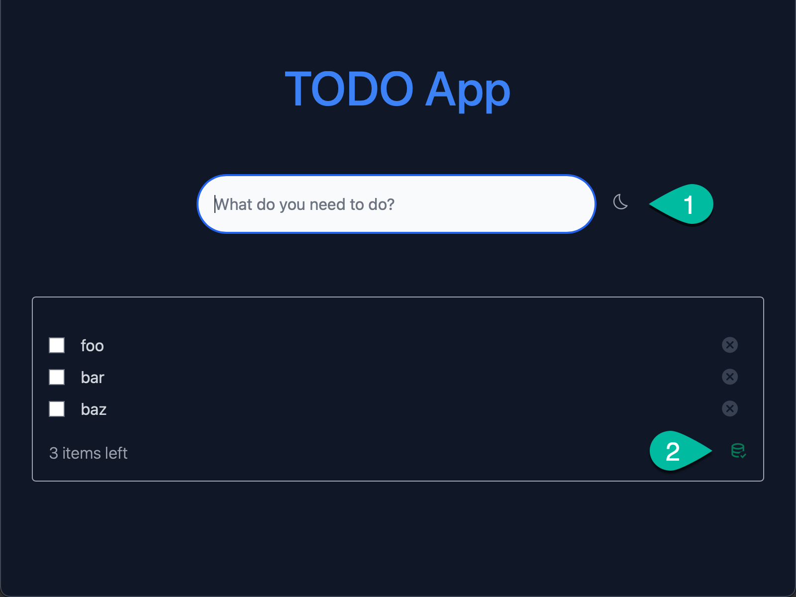
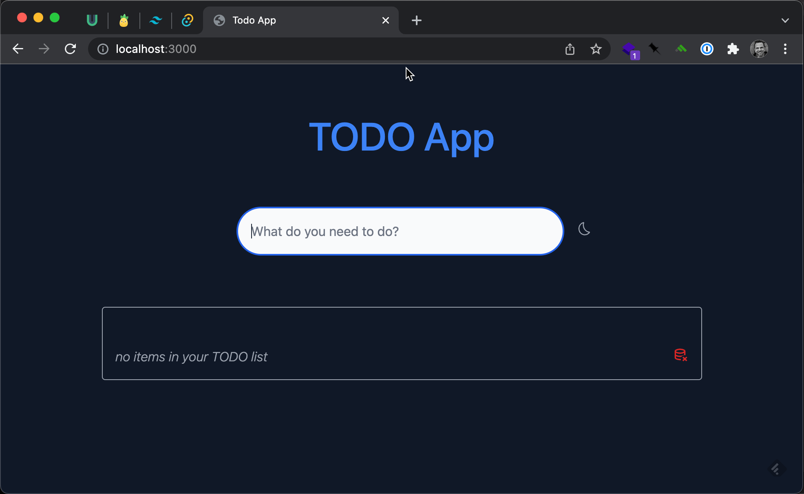

# VueJS with Vite Example

Another TODO app but with VueJS 3.x and the ViteJS bundler.

## Installation

This was built with the **pnpm** package manager in mind but feel free to use whatever you like:

```bash
# pnpm
pnpm install
# yarn
yarn install
# npm
npm install
```

## Development

To run both the frontend and backend in _development_ mode simply run:

```bash
pnpm run dev
```

This will boot up the ViteJS bundler for the frontend and then open up dev mode for Tauri in the backend. You will see a native window popup with the application that looks something like this:



Features: 
1. **Add a new todo** in input and press enter or plus button
2. **Light/Dark mode** toggle as highlighted by #1 above
3. **Completion** check the checkbox to mark as completed
4. **Remove** click the cancel icon on an existing TODO to remove it

In addition please note the green icon (highlighted as #2) which indicates that SQLite database has been connected to. 

The frontend app has been designed such that it will still "work" without this connection but without the DB connection, the state is ephermeral and will be lost the next time you run the app. 

> Note: when you package the app as a binary during build, this app currently will not have write permissions (open issue) and therefore you'll have a frontend only state mgmt solution.

### Frontend Only

If you want, you can startup the frontend only and get full hot-module replacement as well as frontend state management while you work. You can do this with:

```bash
pnpm run dev:frontend
```

This will start the ViteJS bundler running in **dev** mode and provide the UI at `localhost:3000`. The screen will look something like this:



> Note the red icon for DB connection because, as expected, SQLite is not available here but you can add and remove TODO's

## Building

To build the application to a binary you will run:

```bash
pnpm run build
```