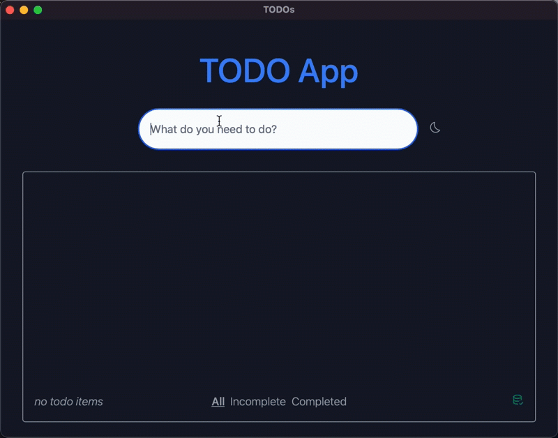
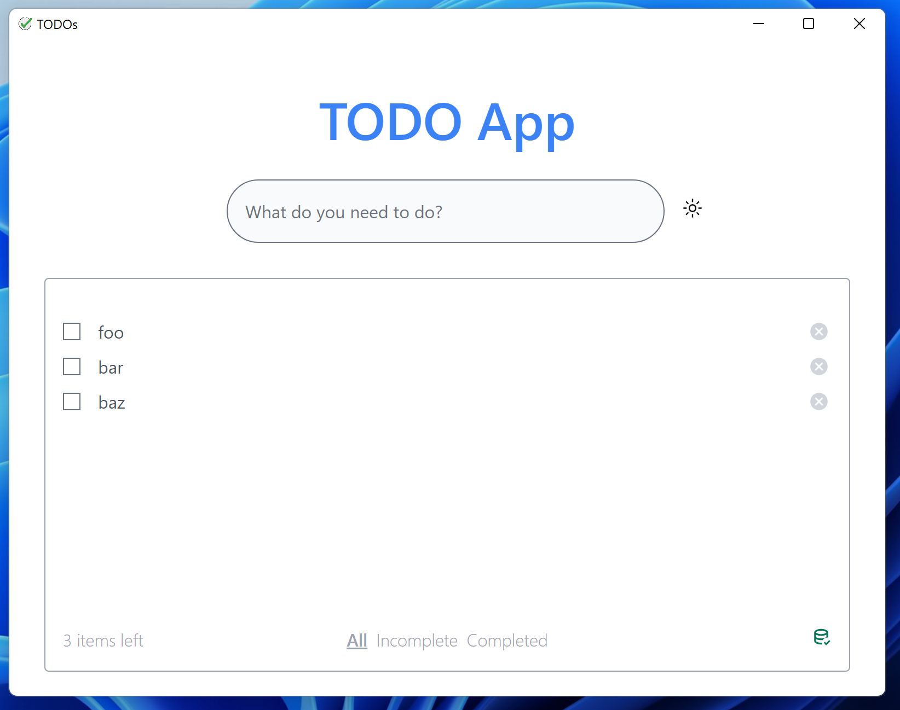
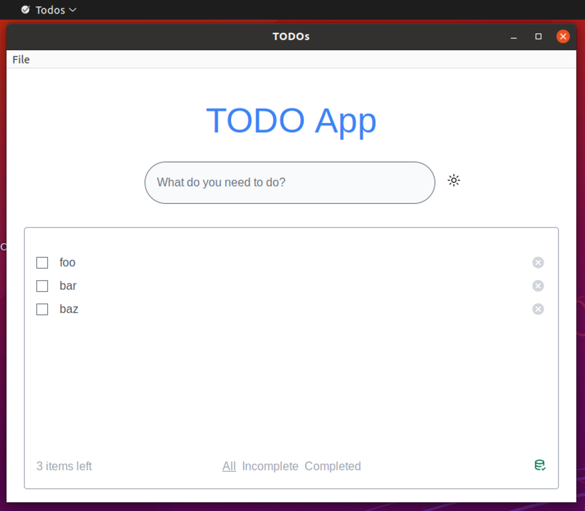
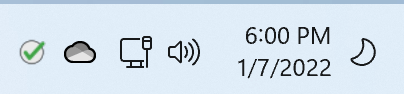
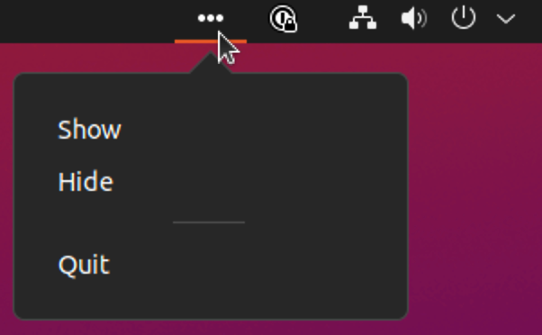

# VueJS with Vite Example

Another TODO app but with VueJS 3.x and the ViteJS bundler.

## Installation

This was built with the **pnpm** package manager but Yarn should work as well:

```bash
# pnpm
pnpm install
# yarn
yarn install
```

> Note: due to the more limited support of workspaces, do no use **npm** to install

## Development

To run both the frontend and backend in _development_ mode simply run:

```bash
pnpm run dev
```

This will boot up the ViteJS bundler for the frontend and then open up dev mode for Tauri in the backend. You will see a native window popup with the application that looks something like this:

| Mac OS                               |
| ------------------------------------ |
|  |

| Windows                                      | Linux                                       |
| -------------------------------------------- | ------------------------------------------- |
|  |  |

Features: 
1. **Add a new todo** in input and press enter or plus button
2. **Light/Dark mode** toggle
3. **Completion** check the checkbox to mark as completed
4. **Filtering** filter the TODO list to only those _completed_ or those still _incomplete_
5. **Remove** click the cancel icon on an existing TODO to remove it

In addition please note the green icon (in the lower right) which indicates that SQLite database has been connected to. If there was an error connecting to the DB the icon would turn red and hovering over it will display the error.

### System Tray

We've added a system tray as well to show how this can interact with the main window. The demonstration below is how it would look on macOS:


| Windows                                                | Ubuntu                                               |
| ------------------------------------------------------ | ---------------------------------------------------- |
|  |  |

### Frontend Only

If you want, you can startup the frontend only and get full hot-module replacement as well as frontend state management while you work. You can do this with:

```bash
pnpm run dev:frontend
```

This will start the ViteJS bundler running in **dev** mode and provide the UI at `localhost:3000`.

> Note the red icon for DB connection because, as expected, SQLite is not available here but you can add and remove TODO's as they are being stored in memory.

## Building

To build the application to a binary you will run:

```bash
pnpm run build
```